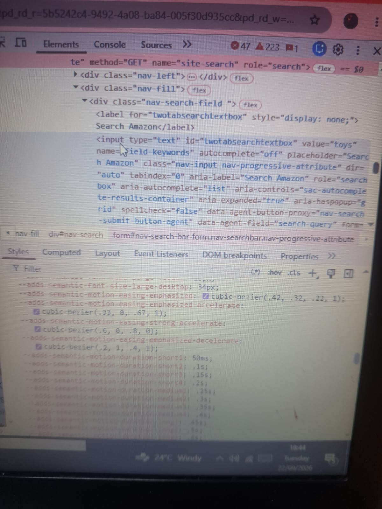

# Devtools Exploration
## Website 1
[website](https://example.com)
### 1. Html tags used
- `<title>`
- `<meta>`
- `<link>`
- ``
4. `

`
5. ``

#### Find form element and state it inputs
I found `<form></form>` element
##### Inputs
`<inputtype="text"></input>`
###### Screenshort of the element panel

